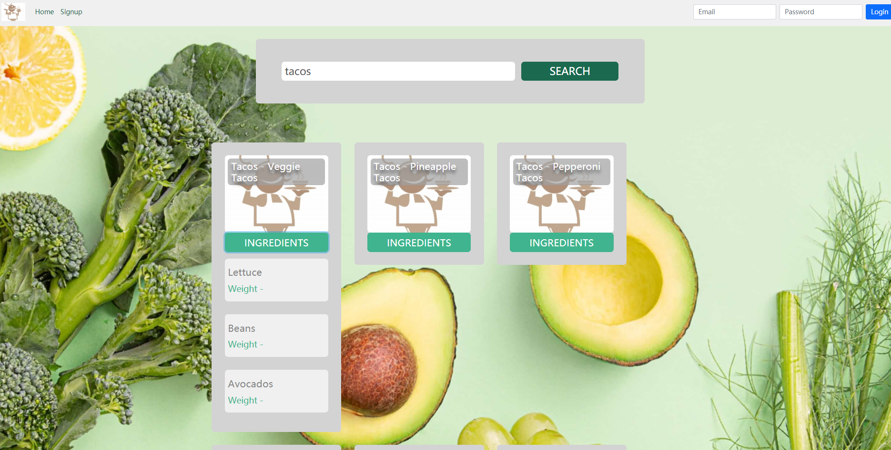

# Search-Your-Recipe

## Authors:
Bernard Ekezie & Yuehan Pei

Class Link: https://johnguerra.co/classes/webDevelopment_spring_2021/

# Project Objective:

Website where users can search food and recipes and upload their own recipes, implmented with design, accessibility and usability.

Light Mode

Dark Mode

Signup

Create Recipe Page: Must be logged in to view this page

Search Function

Shows ingredients displayed when ingredient button is clicked on

## Instructions to build:

yarn install

cd front

yarn install

yarn build

yarn start
And check your http://localhost:3001

## Alternative
For development start the two servers

yarn install

yarn nodemon
And the backend will run on http://localhost:3001

cd front
yarn install

yarn start
And the frontend will run on http://localhost:3000

Ensure that you have installed locally:
- Node.js
- MongoDB

Demo video: https://www.youtube.com/watch?v=J5L0DaSaDxE
